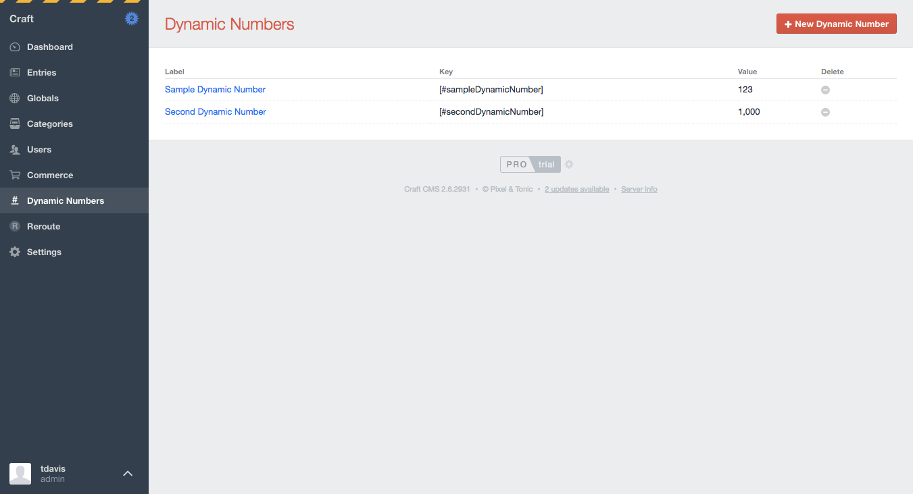

# Dynamic Numbers plugin for Craft CMS

Interface to manage numbers to be reused throughout the site and only edited once



## Installation

To install Dynamic Numbers, follow these steps:

1. Download & unzip the file and place the `dynamicnumbers` directory into your `craft/plugins` directory
4. Install plugin in the Craft Control Panel under Settings > Plugins
5. The plugin folder should be named `dynamicnumbers` for Craft to see it.  GitHub recently started appending `-master` (the branch name) to the name of the folder for zip file downloads.

Dynamic Numbers works on Craft 2.5.x and above.

## Dynamic Numbers Overview

Dynamic Numbers was built to provide a single place for frequently used numbers to be stored and then used in various places throughought a site.

## Configuring Dynamic Numbers

Add as many Dynamic Numbers as necessary in the Dynamic Numbers section of the Control Panel.

## Using Dynamic Numbers

Use the *key* for each Dynamic Number in your fields to automatically pull that number in. For example, if an entry has a summary field, you can drop `[#sampleDynamicNumber]` into the content for that field, and then in the template, you want to pass the summary text through the `dynamicNumbers` filter to automatically replace the *keys* with their *values*.

```
{{ entry.summary | dynamicNumbers }}
```